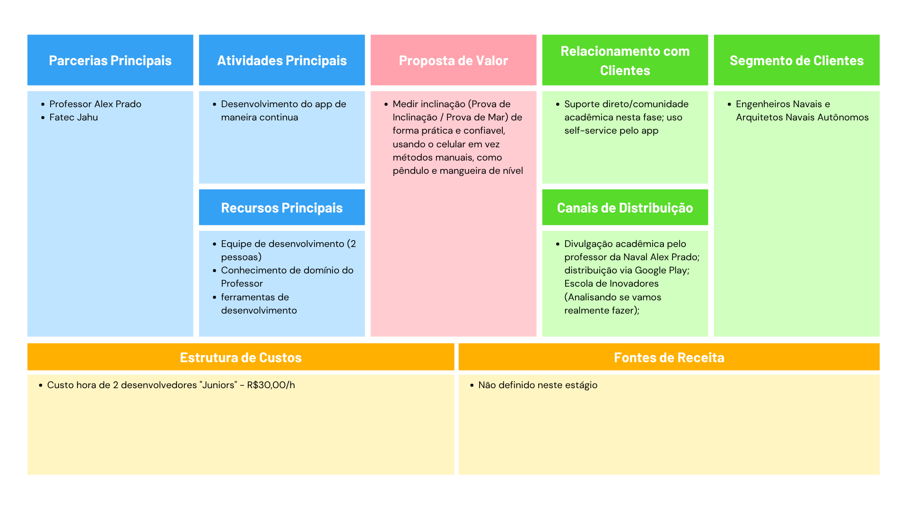
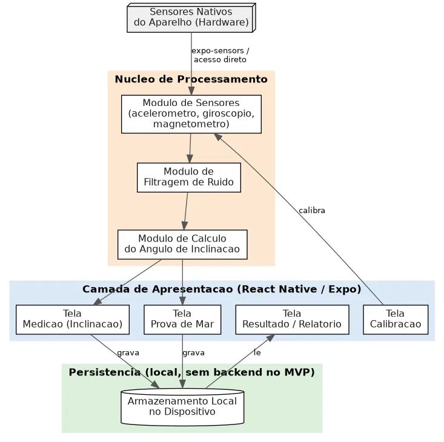

# Plano de Projeto Ágil de Software — Inclination Test

## 1. Introdução

O **Inclination Test** é um aplicativo móvel para automatizar a Prova de Inclinação e a Prova de Mar de embarcações, hoje realizadas manualmente com pêndulo e mangueira de nível. O app usa os sensores nativos do celular (acelerômetro, giroscópio, magnetômetro) para medir o ângulo de inclinação da embarcação, comparando o resultado com o método tradicional para validar sua precisão.

Este documento formaliza o projeto ágil de software referente ao Projeto Integrador do 5º semestre, descrevendo a solução, seu contexto, a arquitetura básica, o planejamento de atividades, responsabilidades e os marcos de entrega do semestre. O foco será exclusivamente para a entrega do MVP, com menção sobre planos futuros, mas que ainda não está definido.

### Contexto de negócio

Este projeto está sendo desenvolvido como Projeto Integrador da Fatec, tendo o professor Alex Prado como stakeholder envolvido.

**Canvas do Modelo de Negócio:**



### Contexto do aplicativo móvel

O app é isolado/standalone nesta fase do MVP: toda a medição, cálculo e armazenamento acontecem localmente no dispositivo, pois é uma aplicação para ser utilizada para fins de medição na própria embarcação.

Ele não faz parte de um ecossistema maior hoje, mas foi desenhado prevendo evolução futura (fora do escopo deste MVP) para integrar uma plataforma com transmissão de dados em tempo real e login de usuário.

### Motivação

O processo atual de Prova de Inclinação depende de instrumentos analógicos (pêndulo, mangueira de nível) e leitura manual, sujeita a erro humano e a um setup mais lento. A motivação do projeto é simplificar esse processo usando uma ferramenta que qualquer engenheiro naval já tem em mãos — o celular — tornando a medição mais rápida sem abrir mão da precisão exigida pela prática profissional.

### Identificação do grupo de trabalho
| Campo | Informação |
|---|---|
| Nome da equipe | JLY |
| Weverton Ryan (Porta Voz) | HTML, CSS, JS, React, C#, Node.js, MongoDB, C#, Docker, Lógica de Programação, Estrutura de Dados, Big Data, Gestão de Projetos |
| Pedro Mineo | HTML, CSS, JS, React, C#, Node.js, SQL, MongoDB, PHP, Habilidades de Comunicação |
### Repositório

Link do Repositório: [https://github.com/wevertonryan/inclination-test](https://github.com/wevertonryan/inclination-test)

---

## 2. Aplicativo para Dispositivo Móvel

### Visão do produto

Ser a ferramenta de referência para Engenheiros e Arquitetos Navais realizarem Provas de Inclinação e de Mar de forma digital, prática e confiável, substituindo o pêndulo e a mangueira pelos sensores do próprio celular. Quando completamente pronto e validado, o app deve ser aceito como método equivalente ao tradicional para uso real em campo.

### Objetivos do desenvolvimento do app

O app deve ser desenvolvido para simplificar o processo de medição da Prova de Inclinação e da Prova de Mar, hoje manual e dependente de instrumentos físicos específicos. Ele servirá para captar os dados dos sensores do celular, calibrá-los, calcular o ângulo de inclinação com precisão próxima à do método tradicional (pêndulo) e apresentar/registrar esse resultado — servindo tanto para uso prático em campo quanto como estudo acadêmico de viabilidade do uso de sensores de smartphone para esse fim.

### Arquitetura básica

O app é organizado em três camadas, todas rodando localmente no dispositivo (sem backend no MVP):

1. **Camada de Apresentação** (React Native/Expo): telas de Calibração, Medição, Prova de Mar e Resultado/Relatório.
2. **Núcleo de Processamento**: módulo de acesso aos sensores nativos (acelerômetro, giroscópio, magnetômetro), módulo de filtragem de ruído e módulo de cálculo do ângulo de inclinação.
3. **Persistência local**: armazenamento no próprio dispositivo, sem sincronização em nuvem nesta fase.

O fluxo é: os sensores nativos alimentam o módulo de sensores → os dados passam pelo filtro de ruído → o módulo de cálculo determina o ângulo → o resultado é exibido nas telas de Medição/Prova de Mar e gravado localmente → a tela de Resultado lê os dados salvos para gerar o relatório. 



OBS: Ainda para análisar sobre esse fluxo se será desse jeito mesmo

### Metas e restrições da arquitetura

| Item | Definição | Justificativa |
|---|---|---|
| Tipo de app | Híbrido (React Native + Expo) | Time já tem experiência com Node.js/React, reduzindo a curva de aprendizado e acelerando o desenvolvimento dentro do prazo do semestre |
| Plataforma | Apenas Android nesta fase | Precisão dos sensores precisa ser validada por dispositivo; restringir a plataforma reduz a variável de hardware desconhecido. iOS pode ser reavaliado se a limitação de acesso a sensores não se confirmar um problema |
| Acesso a sensores | `expo-sensors`, com possível necessidade de acesso mais direto ao hardware 🟨 | A ser confirmado por spike técnico (Sprint 01) — a aplicação exige alta precisão, e ainda não se sabe se a camada de abstração do Expo é suficiente |
| Backend/nuvem | Nenhum no MVP | Escopo do MVP é validar a medição local; sincronização em nuvem é recurso futuro |
| Autenticação | Nenhuma no MVP | App é apenas de medição; login só seria necessário para recursos futuros como transmissão em tempo real |
| Orçamento de infraestrutura | R$ 0,00 — GitHub e camada gratuita do Expo EAS Build | Restrição de orçamento do projeto acadêmico |

---

## 3. Projeto Ágil de Software

### Escopo

**Dentro do escopo do MVP:**
- Captura de dados dos sensores nativos para cálculo do ângulo de inclinação.
- Calibração do sensor em 1 clique, ou automaticamente antes de cada medição.
- Cálculo do ângulo de banda (Prova de Inclinação).
- Geração dos dados/relatório da prova.
- Interface para uso em campo (convés).

**Fora do escopo do MVP:**
- Registro de série temporal (Prova de Mar).
- Visualização remota em tempo real para terceiros.
- Armazenamento em nuvem / sincronização automática.
- Contas de usuário / login.
- iOS (ver restrições de arquitetura).
- Certificação oficial junto a órgãos marítimos.

Não é o app completo da visão de produto: é o subconjunto necessário para validar, em ambiente real, se sensores de smartphone atingem precisão aceitável para a Prova de Inclinação — a evolução para produto completo (login, tempo real, nuvem) é trabalho futuro fora deste semestre.

### Papéis e responsabilidades

Por ser um time de 2 pessoas, ambos os membros desenvolvem todas as etapas da aplicação juntos, dividindo tarefas específicas conforme a demanda aparece — não há papéis fixos e estanques no dia a dia. Ainda assim, para fins de responsabilização formal:

| Papel | Responsável | Responsabilidades principais |
|---|---|---|
| Product Owner (PO) | Professor da disciplina | Fornece Ideiais e Insights, fornece conhecimento técnico na área, Valida entregas de cada marco (EP2/EP3/EF), aprova a precisão obtida |
| Dev (Mobile Fullstack) | Membro 1 e Membro 2 | Implementação de todas as camadas do app (sensores, cálculo, UI, persistência) |
| Levantamento de requisitos / Gestão de projeto | Membro 1 | Organização do cronograma, levantamento de requisitos junto ao Professor |
| QA (testes de precisão) | Membro 2 | Criação e execução dos testes da aplicação |
| UX (usabilidade de campo) | Membro 1 e Membro 2 | Ajustes de legibilidade/usabilidade para uso no convés |

### Backlog do produto

> Estimativas em Story Points (Fibonacci: 1,2,3,5,8,13), a recalibrar após o primeiro Sprint.

| ID | História de usuário | Prioridade |
|---|---|---|
| US-01 | Como engenheiro naval, quero calibrar o sensor (em 1 clique ou automaticamente antes da medição), para garantir que o ponto zero esteja correto. | P0 |
| US-02 | Como engenheiro naval, quero medir o ângulo de inclinação em tempo real na tela, para acompanhar a Prova de Inclinação. | P0 |
| US-03 | Como engenheiro naval, quero que o app filtre o ruído dos dados do sensor, para reduzir erro de leitura. | P0 |
| US-04 (futuro) | Como arquiteto naval, quero registrar uma série temporal de inclinação durante a navegação (Prova de Mar). | P1 |
| US-05 | Como engenheiro naval, quero que os dados coletados e o ângulo calculado sejam documentados/exportados, para formalizar a prova. | P1 |
| US-06 | Como engenheiro naval, quero uma interface fácil de usar, para operar o app em condições reais. | P1 |
| US-07 | Como engenheiro naval, quero que os dados fiquem salvos no celular após a medição, para não perder o resultado se o app fechar. | P1 |
| US-08 | Como engenheiro naval, quero usar o app sem internet, pois embarcações costumam não ter sinal. | P1 |
| US-09 (futuro) | Como stakeholder fora do barco, quero visualizar os dados em tempo real remotamente. | P2 |
| US-10 (futuro) | Como dono dos dados, quero que as medições sejam enviadas automaticamente para um servidor. | P2 |

### Divisão do trabalho em grandes fases (marcos)

| Marco | Entrega | Data prevista |
|---|---|---|
| **EP2** | Pitch do 1º marco — Épico 1 completo (Sensores; Calculos; Calibração; Filtragem de Ruído; Testes;) | 02/10/2026
| **EP3** | Pitch do 2º marco — Épico 2 completo (UX; Telas; Relatorios; Aplicativo Completo;) | 06/11/2026 |
| **EF** | Entrega Final — Épico 3 concluído App Completo + envio de todos os entregáveis (Documentação, Slides) | Até 20/11/2026 (meta interna: 13/11/2026), prazo formal da disciplina em 22/11/2026 |

### Planejamento de Sprints

```txt
# 1. Organização do Projeto
- Plano de Projeto
- Resolver alguns assuntos sobre o projeto com o professor
- Definir pontos (Arquitetura, Telas, Conceito para apresentar ao professor e ele confirmar que está certo)
- Organização do Projeto com tecnologias

# 2. Prova de Conceito
- Conseguir captar as informações dos sensores
- Calibração
- Implementação dos Calculos
- Filtragem de Ruído
- Teste em Embarcação

# 3. Estruturação em Aplicativo
- Criação de Identidade Visual
- Aprimoramento do UX
- Desenvolvimento das Telas juntamente com a parte de processamento (Calibração em 1 clique)
- Geração de Relátorios

# 4. Documentação e Apresentação
- Documentação README.MD
- Apresentação Powerpoint
- Treinamento da Apresentação
```

| Mês/Épico | Sprint Nº | Foco/Objetivo da Sprint |
|---|---|---|
| Set / Épico 2 | Sprint 01 (04/09) | Organização do Projeto |
| Set / Épico 2 | Sprint 02 (11/09) | Captar sensores, Calibração e Calculos |
| Set / Épico 2 | Sprint 03 (18/09) | Calculos e Filtragem de Ruído |
| Set / Épico 2 | Sprint 04 (25/09) | Calculos e Teste em Embarcação |
| — | **EP2** (02/10) | Sensores; Calculos; Calibração; Filtragem de Ruído; Testes; |
| Out / Épico 3 | Sprint 05 (09/10) | Identidade Visual, Telas e UX |
| Out / Épico 3 | Sprint 06 (16/10) ⚠️ feriado | Telas e Relátorios|
| Out / Épico 3 | Sprint 07 (23/10) | Telas | 
| Out / Épico 3 | Sprint 08 (30/10) | Retoques da aplicação e Testes |
| — | **EP3** (06/11) | UX; Telas; Relatorios; Aplicativo Completo; |
| Nov / Épico Final | Sprint 09 (13/11) | Documentação e Apresentação |
| — | **EF** (até 20/11) | Documentação e Apresentação |

> Semana de 23 a 27/11 é reserva de contingência da disciplina (Semana do Projeto Integrador de DSM), sem tarefas de sprint alocadas.

### Definição de preparada (Definition of Ready)

- História no formato "Como... quero... para...", com critério de aceitação Given/When/Then.
- Testes desenhados.
- Dependências técnicas identificadas e resolvidas.
- Quando envolver conhecimento naval (fórmulas, normas), validado previamente com o Professor.

### Definição de pronta (Definition of Done)

- Ter atendido ao critério de aceitação
- Código aprovado em todos os testes (Unitário, Integrado, EA2)
- Código funcionando no dispositivo Android de teste.
- Validado manualmente.
- Sem bugs bloqueantes conhecidos.
- Código versionado no repositório Git.
- Quando envolver precisão de medição: ser testado em uma embarcação real
- Quando envolver precisão de medição: validado com dado de referência manual (pêndulo).
- Aprovado pelo professor

### Gestão de riscos

| Risco | Probabilidade | Impacto | Mitigação |
|---|---|---|---|
| Sensores do celular não atingem precisão suficiente | Média | Crítico | Testar precisão desde o Sprint 01; comparar sistematicamente com o pêndulo |
| `expo-sensors` não oferecer controle/precisão suficiente | Média | Alto | Spike técnico no Sprint 01; alternativa é acesso mais direto ao hardware |
| Falta de acesso a embarcação real para teste | Média | Alto | Agendar com o Professor já no Sprint 01, não deixar para a Sprint 09 |
| Orçamento zero limita ferramentas | Baixa | Médio | Usar apenas camadas gratuitas (Expo, GitHub) |
| Atraso por dependência do Professor (fórmulas, normas, agenda) | Média | Alto | Levar essas perguntas já para a Sprint 01, com prazo de resposta combinado |